<!-- THIS FILE IS REGENERATED WEEKLY BY .github/workflows/refresh.yml — DO NOT HAND-EDIT -->


<table>
  <tr>
    <td></td>
    <td>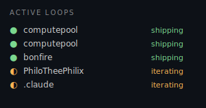</td>
    <td>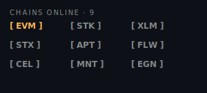</td>
  </tr>
  <tr>
    <td></td>
    <td>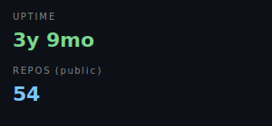</td>
    <td>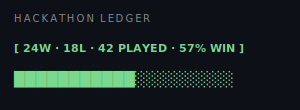</td>
  </tr>
  <tr>
    <td>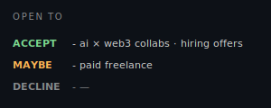</td>
    <td>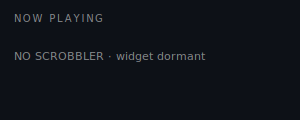</td>
    <td>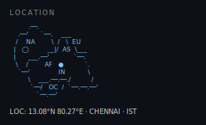</td>
  </tr>
  <tr>
    <td><a href="https://github.com/Philotheephilix?tab=repositories">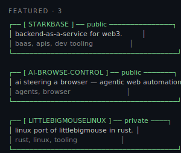</a></td>
    <td><a href="https://github.com/Philotheephilix">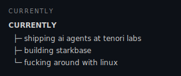</a></td>
    <td><a href="https://philotheephilix.in">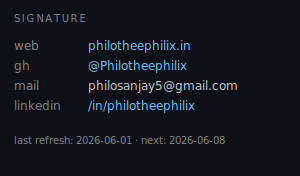</a></td>
  </tr>
</table>

