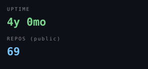
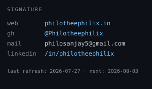

<!-- THIS FILE IS REGENERATED WEEKLY BY .github/workflows/refresh.yml — DO NOT HAND-EDIT -->
<!-- BANDHANI FIELDS — design system matching philotheephilix.in -->

---

> **`full stack · web3 · ai`** &nbsp;·&nbsp; starkbase &nbsp;`✦`&nbsp; tensornode &nbsp;`✦`&nbsp; agentic ai &nbsp;`✦`&nbsp; cross-chain dApps &nbsp;`✦`&nbsp; tauri desktop &nbsp;`✦`&nbsp; mcp plumbing &nbsp;`✦`&nbsp; zk-proofs &nbsp;`✦`&nbsp; rust &nbsp;`✦`&nbsp; next.js &nbsp;`✦`&nbsp; 0→1 product

---

<table>
  <tr>
    <td valign="top"></td>
    <td valign="top"></td>
    <td valign="top"></td>
  </tr>
  <tr>
    <td valign="top"></td>
    <td valign="top"></td>
    <td valign="top"></td>
  </tr>
  <tr>
    <td valign="top"></td>
    <td valign="top"></td>
    <td valign="top"></td>
  </tr>
</table>

---

**[web](https://philotheephilix.in)** &nbsp;·&nbsp;
**[github](https://github.com/philotheephilix)** &nbsp;·&nbsp;
**[linkedin](https://linkedin.com/in/philotheephilix)** &nbsp;·&nbsp;
**[x](https://x.com/philotheephilix)** &nbsp;·&nbsp;
**[cal](https://cal.com/philotheephilix)**

refreshed `2026-08-23` · next `2026-08-30`

